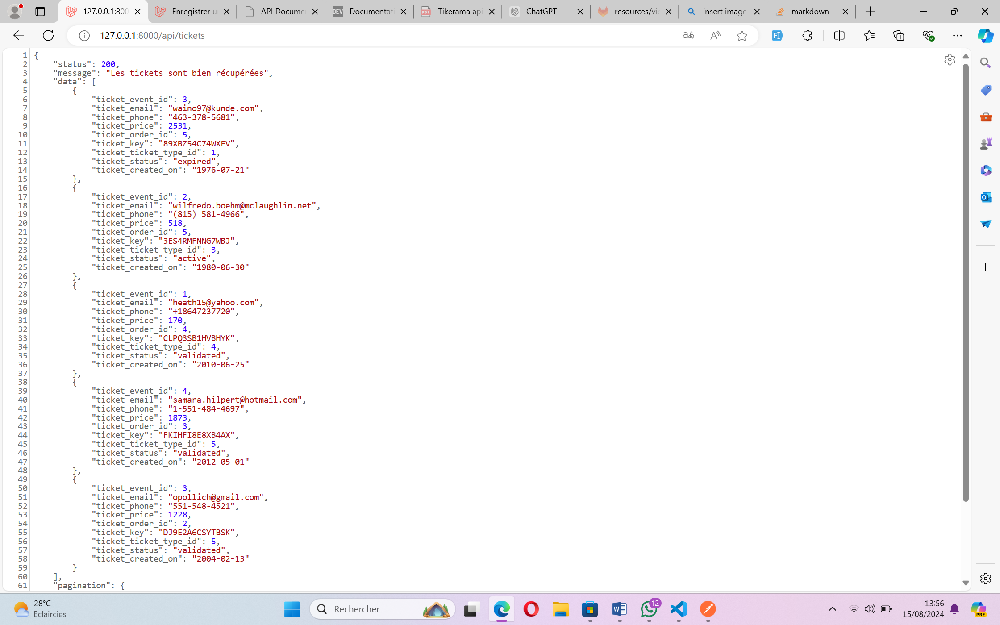

# DOCUMENTATION DE L'API
Utilisé les endpoints ci-dessous pour exploiter cet API
## Endpoints
### Event
- **GET /api/events** : Consulter la liste des événements en cours : Pagination incluse.

- **GET /api/event/{id}/tickets** : Consulter la liste des types de tickets disponibles pour un événement donné. (ex. **/api/event/4/tickets** pour consulter les types de tickets disponible pour l'événement ayant l'identifiant 4).

<!--  -->

- **POST /api/events** : Créer un événement. Attribut necessaire pour la création : 
{'event_category', 'event_title', 'event_description', 'event_date', 'event_image', 'event_city','event_address', 'event_status', 'event_created_on'}

- **GET /api/events/{event}** : Consulter un événement en particulier.
- **PUT|PATCH /api/events/{event}** : Modifier les information d'un événement en utilisant les mêmes attributs qu'à la création.
- **DELETE /api/events/{event}** : Supprimer un événement en particulier.

### Intention de commande
- **POST /api/order-intents** : Créer une intention de commande. Attribut necessaire pour la création : *{'order_intent_price', 'order_intent_type', 'user_email', 'user_phone', 'expiration_date'}*

